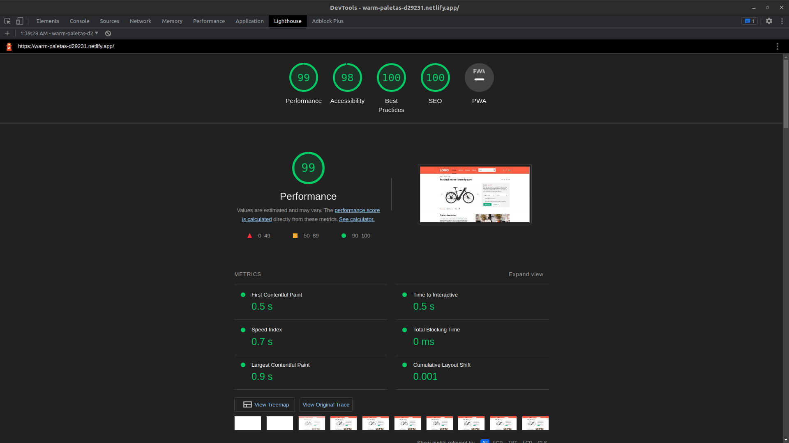
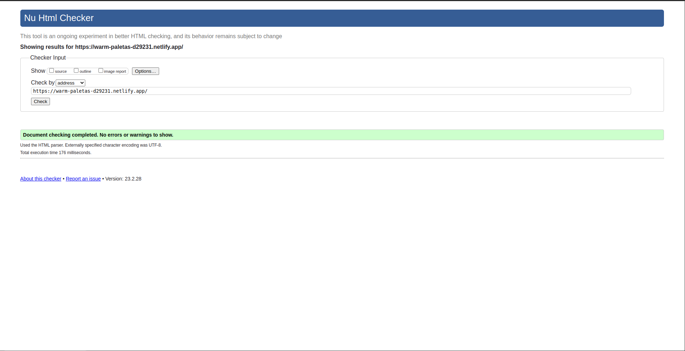

# Sales Page Test Project

## Project URL (Hosted with Netlify)
[Sales Page Test Project URL](https://warm-paletas-d29231.netlify.app/)

## Project Description

Ultra-Responsive and Interactive Website with Beautiful Animations and Working Features

The project is an ultra-responsive website that can adapt seamlessly to various screen sizes, from 4K screens to very small (and outdated :D) devices like the iPhone 4. The website features beautiful animations and working features that include tabs, custom image slider, custom checkboxes, modal window, and a custom theme color for Chrome on Android.

The website is built using HTML, SCSS, and JavaScript, with no libraries or frameworks used, ensuring ultra-clean code. The SCSS code is structured in a way that makes the website easy to expand and maintain, making it scalable for future updates.

One of the key features of the website is its high performance and optimization. It has been tested using both Google Lighthouse and W3C Validator and has received very high scores, indicating that it loads quickly, performs well on various devices, and meets industry standards for web development.

Overall, this project demonstrates a high level of skill and attention to detail in web development, creating a website that not only looks great but also functions smoothly and efficiently while adhering to industry best practices.

## Usage

Run the project with http-server or click on Index.html file.

```bash
npm install http-server -g
```
```bash
http-server
```

## Installation

To watch SCSS or build CSS, open terminal in root folder and type the following command.

```bash
npm install
```
To watch SCSS, type the following command.

```bash
npm run watch:sass
```

To build CSS for production, type the following command.

```bash
npm run build:css
```



